# AIOS - Architecture Diagrams

## 1. System Overview

### 1.1 High-Level Architecture

```mermaid
graph TB
    subgraph "AIOS Desktop Application"
        direction TB
        FE["Frontend<br/>Tauri + React + TypeScript"]
        API["API Gateway<br/>FastAPI + Pydantic"]
        
        subgraph "Core Services"
            AE["Agent Engine"]
            WE["Workflow Engine"]
            MS["Memory Service"]
            KB["Knowledge Base"]
            PM["Plugin Manager"]
            PR["Provider Router"]
            SS["Security Service"]
            OS["Observability"]
        end
        
        subgraph "Data Layer"]
            DB[("SQLite<br/>Primary DB")]
            VD[("Qdrant<br/>Vector Store")]
            GD[("NetworkX<br/>Graph Store")]
            FS["File System<br/>Logs/Artifacts"]
        end
    end
    
    subgraph "External Systems"
        OP["Ollama<br/>Local Models"]
        OR["OpenRouter<br/>Free API"]
        LT["LiteLLM<br/>Proxy"]
        VS["IDEs<br/>VS Code, Cursor"]
        GT["Git<br/>Version Control"]
        DK["Docker<br/>Containers"]
    end
    
    FE -->|"HTTP/WebSocket"| API
    API --> AE
    API --> WE
    API --> MS
    API --> KB
    API --> PM
    API --> SS
    
    AE --> MS
    AE --> KB
    AE --> PR
    WE --> AE
    WE --> MS
    MS --> DB
    MS --> VD
    MS --> GD
    KB --> VD
    KB --> DB
    PM --> SS
    PR --> OP
    PR --> OR
    PR --> LT
    SS --> DB
    OS --> FS
    AE -->|"publish events"| API
    WE -->|"publish events"| API
    
    FE -->|"IDE Extensions"| VS
    AE -->|"Git operations"| GT
    AE -->|"Container ops"| DK
```

### 1.2 Layered Architecture

```mermaid
graph TB
    subgraph "Presentation Layer"
        UI["Dashboard"]
        AG["Agent Monitor"]
        WF["Workflow Designer"]
        MEM["Memory Explorer"]
        KB["Knowledge Browser"]
        CFG["Configuration"]
    end
    
    subgraph "API Layer"
        AGW["API Gateway<br/>Auth + Routing + Rate Limiting"]
        WS["WebSocket Server<br/>Real-time Events"]
    end
    
    subgraph "Service Layer"
        AES["Agent Engine"]
        WFS["Workflow Engine"]
        MMS["Memory Service"]
        KBS["Knowledge Base"]
        PMS["Plugin Manager"]
        PRS["Provider Router"]
        SEC["Security Service"]
        OBS["Observability"]
    end
    
    subgraph "Data Access Layer"]
        DAL["Repository Pattern"]
        VSL["Vector Store Adapter"]
        GSL["Graph Store Adapter"]
    end
    
    subgraph "Storage Layer"]
        SQLITE[("SQLite")]
        QDRANT[("Qdrant")]
        NETWORKX[("NetworkX")]
        FILES["File System"]
    end
    
    UI --> AGW
    AG --> AGW
    WF --> AGW
    MEM --> AGW
    KB --> AGW
    CFG --> AGW
    
    AGW --> AES
    AGW --> WFS
    AGW --> MMS
    AGW --> KBS
    AGW --> PMS
    AGW --> SEC
    
    WS --> OBS
    WS --> AES
    WS --> WFS
    
    AES --> MMS
    AES --> KBS
    AES --> PRS
    WFS --> AES
    
    AES --> DAL
    MMS --> DAL
    MMS --> VSL
    MMS --> GSL
    KBS --> DAL
    KBS --> VSL
    
    DAL --> SQLITE
    VSL --> QDRANT
    GSL --> NETWORKX
    OBS --> FILES
```

## 2. Agent Architecture

### 2.1 Agent Lifecycle

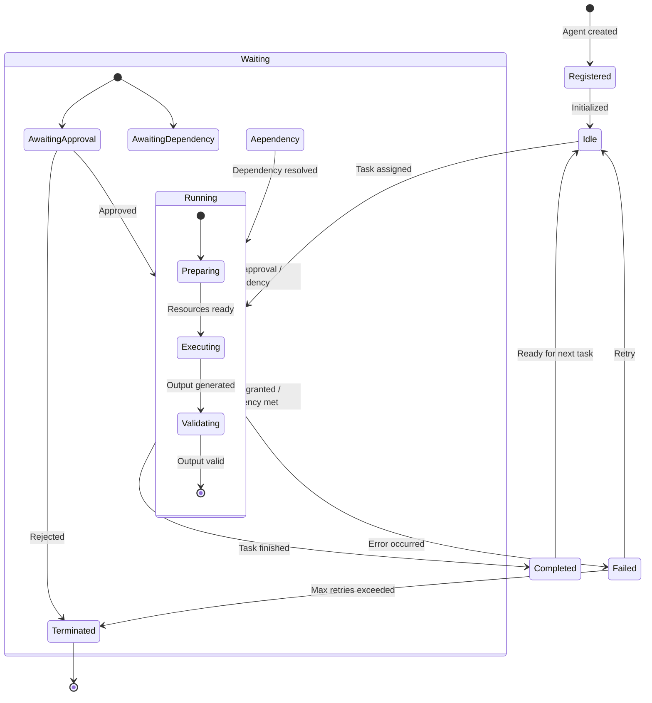

### 2.2 Agent Communication

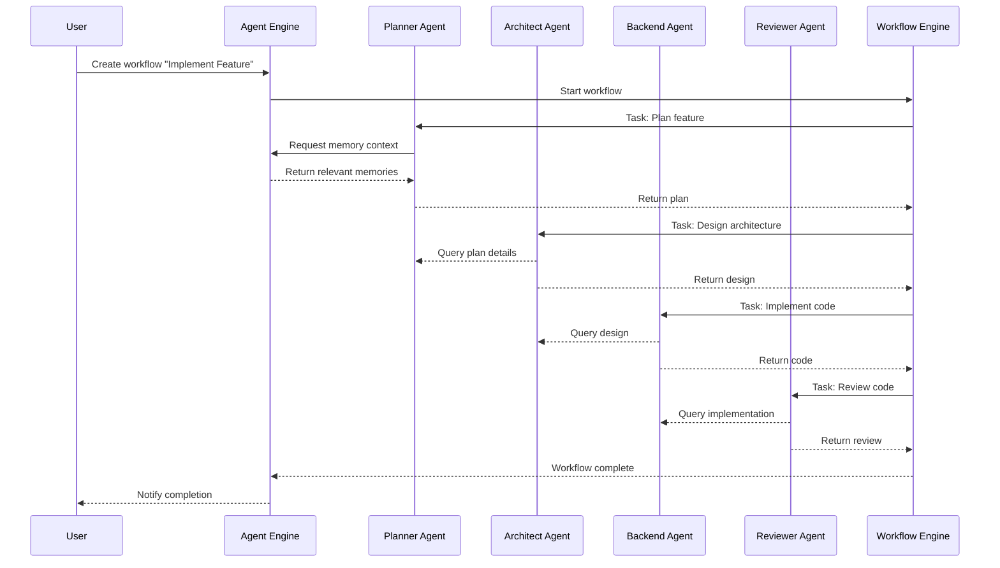

### 2.3 Multi-Agent Collaboration Patterns

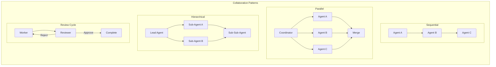

## 3. Workflow Architecture

### 3.1 Workflow DAG

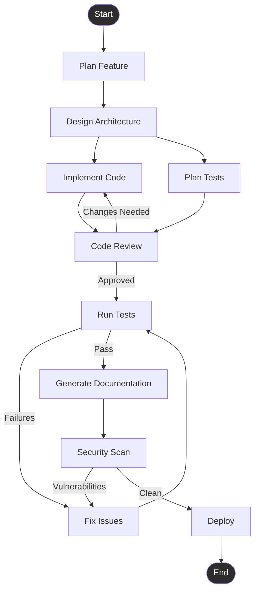

### 3.2 Workflow Engine Architecture

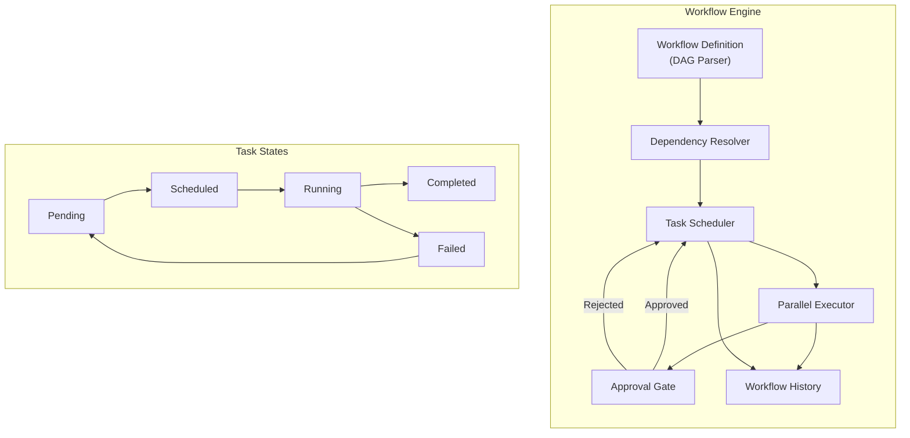

## 4. Memory Architecture

### 4.1 Memory Type Hierarchy

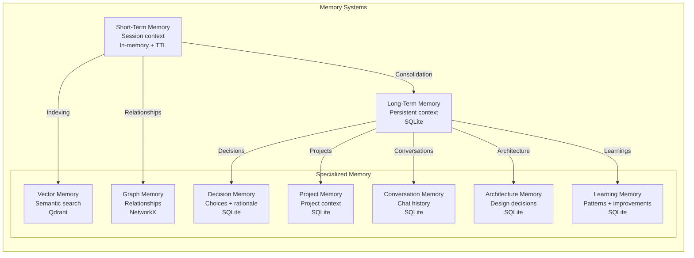

### 4.2 Memory Flow

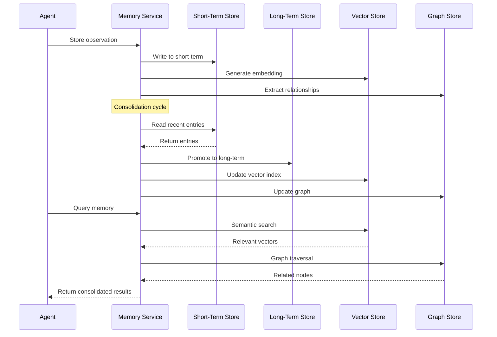

## 5. Provider Architecture

### 5.1 Provider Abstraction

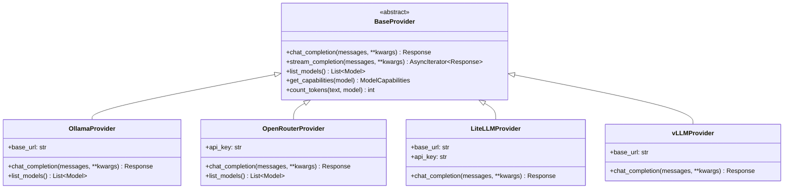

### 5.2 Request Routing Flow

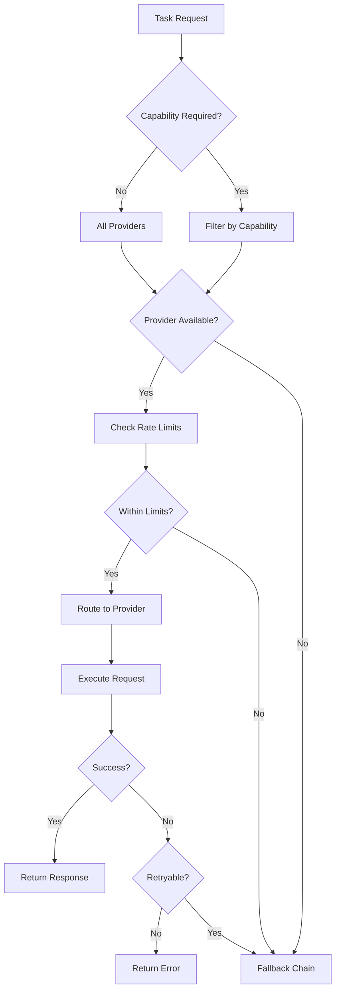

## 6. Security Architecture

### 6.1 Authentication Flow

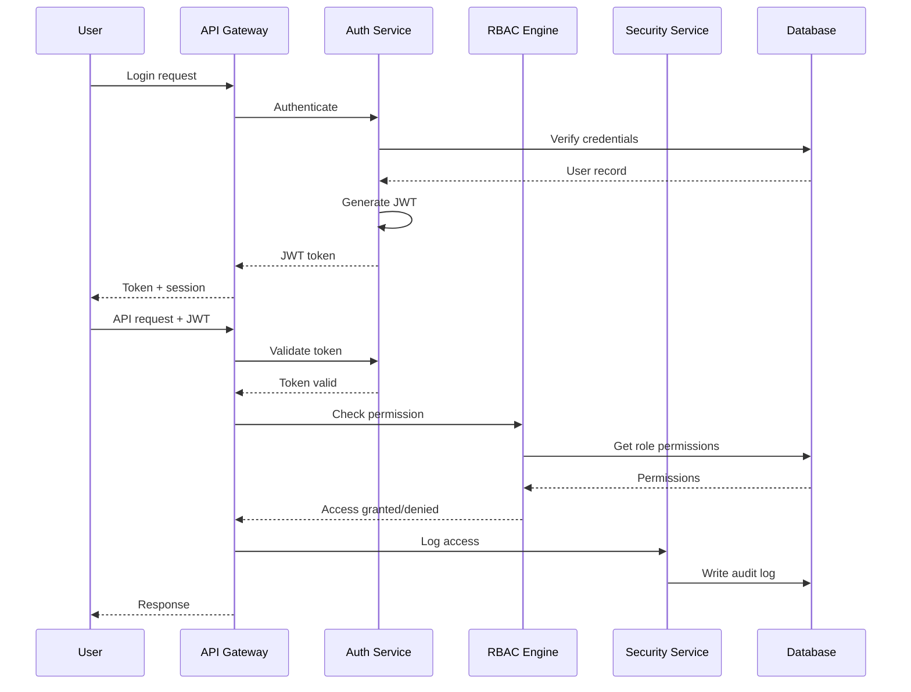

### 6.2 RBAC Model

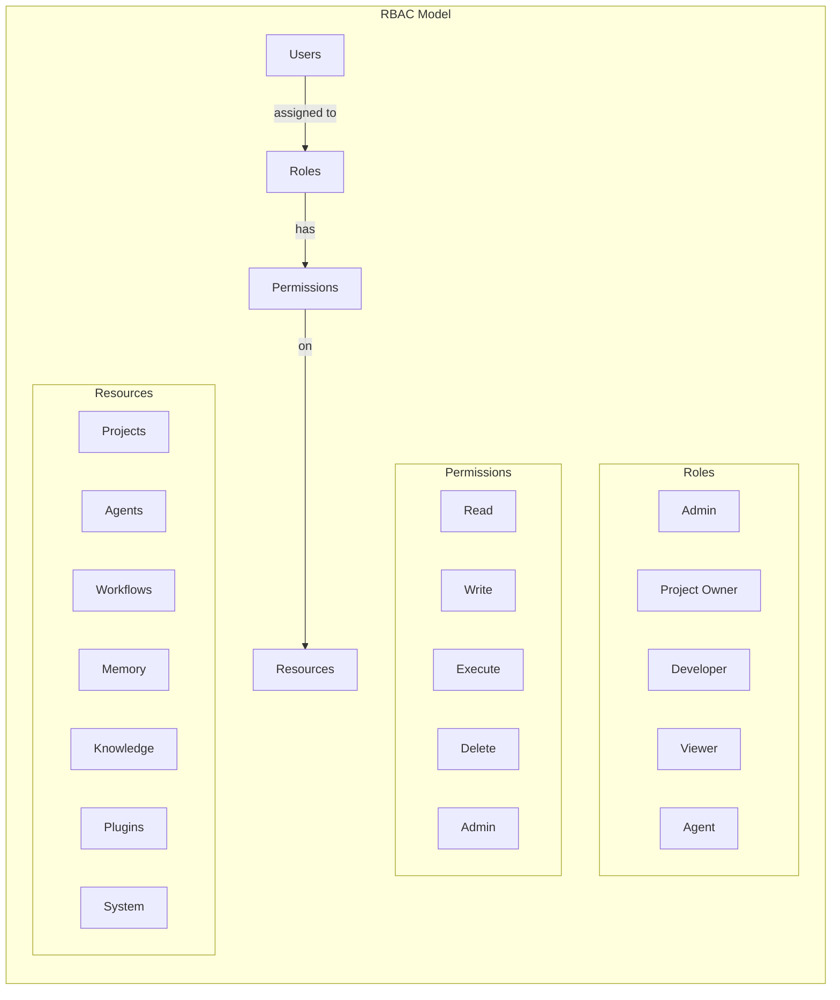

## 7. Plugin Architecture

### 7.1 Plugin Lifecycle

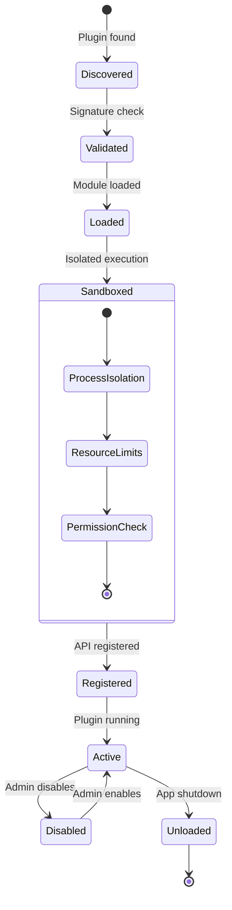

### 7.2 Plugin System Architecture

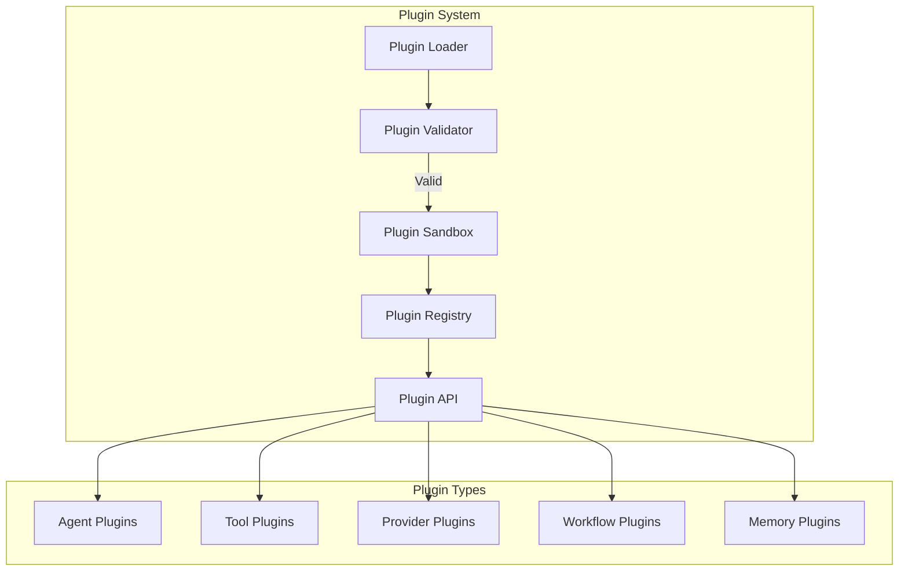

## 8. Deployment Architecture

### 8.1 Local-First Desktop

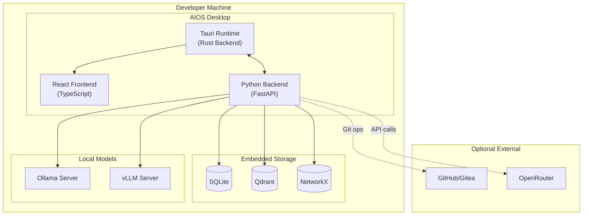

### 8.2 Data Flow

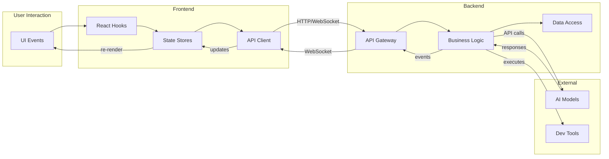

## 9. Observability Architecture

### 9.1 Three Pillars

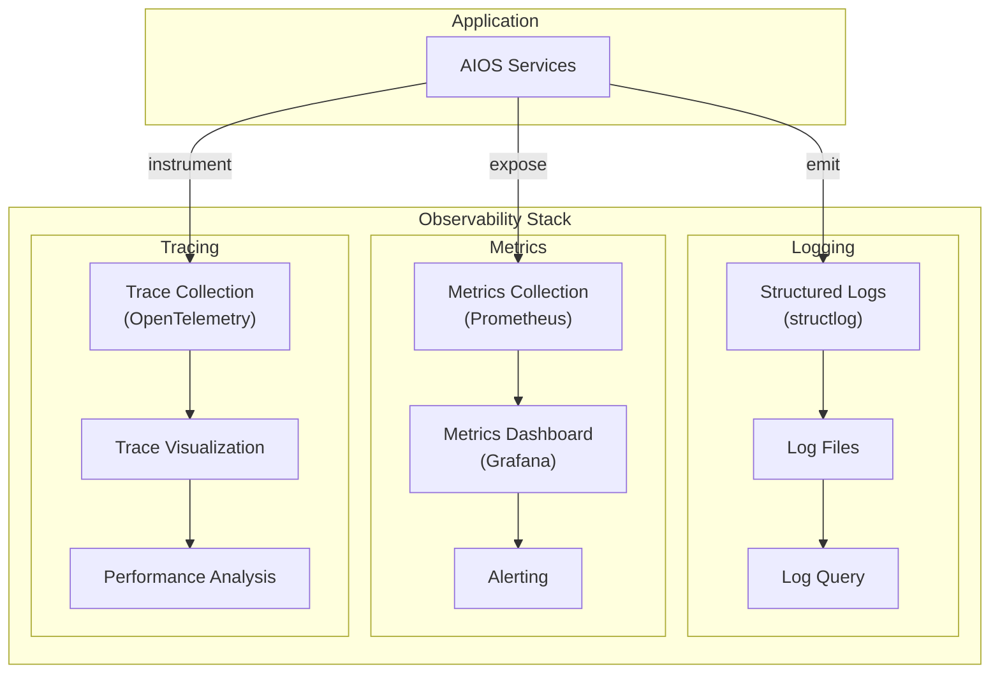

## 10. Self-Improvement Architecture

### 10.1 Improvement Cycle

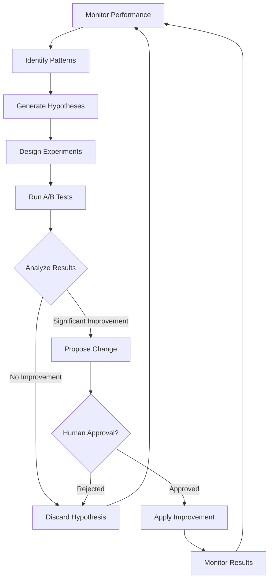

### 10.2 Self-Improvement Data Flow

```mermaid
sequenceDiagram
    participant AE as Agent Engine
    participant SM as Self-Improvement Monitor
    participant PA as Pattern Analyzer
    participant PE as Proposal Engine
    participant HA as Human Approval
    participant CM as Change Manager
    participant PM as Prompt/Config Store
    
    AE->>SM: Log execution metrics
    SM->>PA: Aggregate patterns
    PA-->>SM: Pattern report
    SM->>PE: Generate proposals
    PE-->>SM: Improvement proposals
    SM->>HA: Present for approval
    alt Approved
        HA->>CM: Approve change
        CM->>PM: Apply change
        CM->>AE: Update configuration
    else Rejected
        HA->>SM: Reject proposal
    end
```
